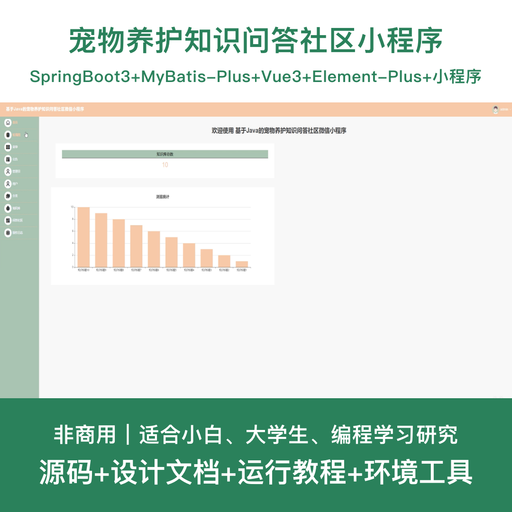
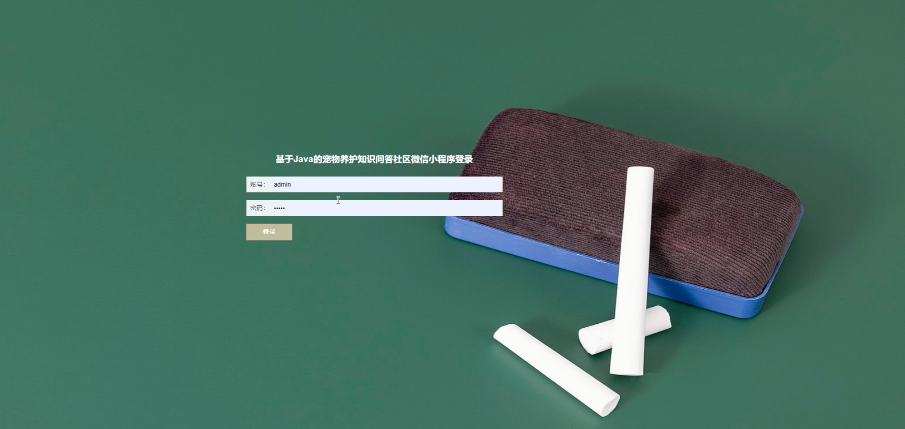
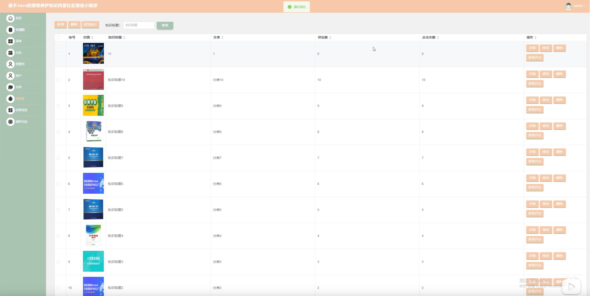
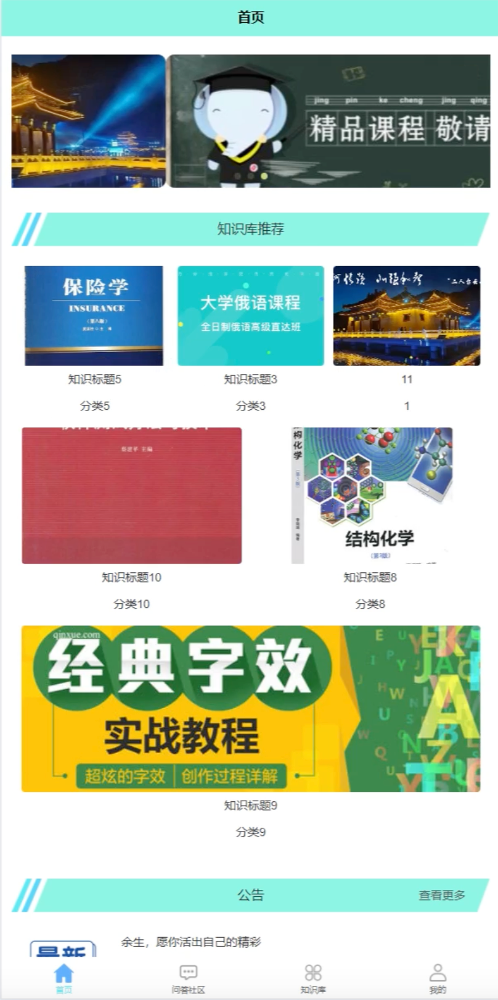
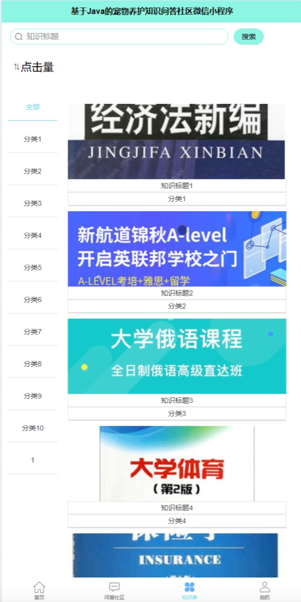
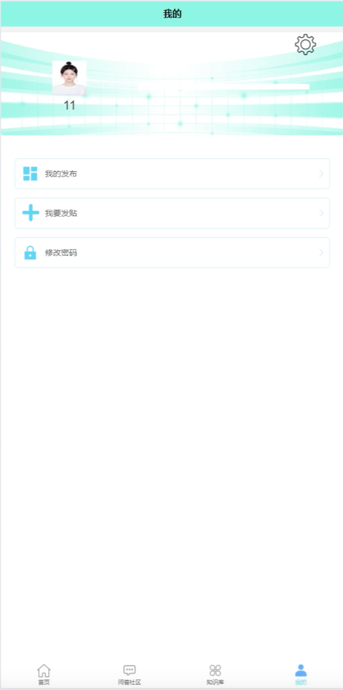
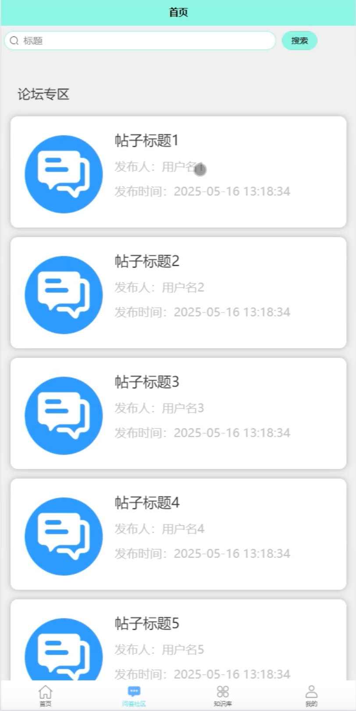
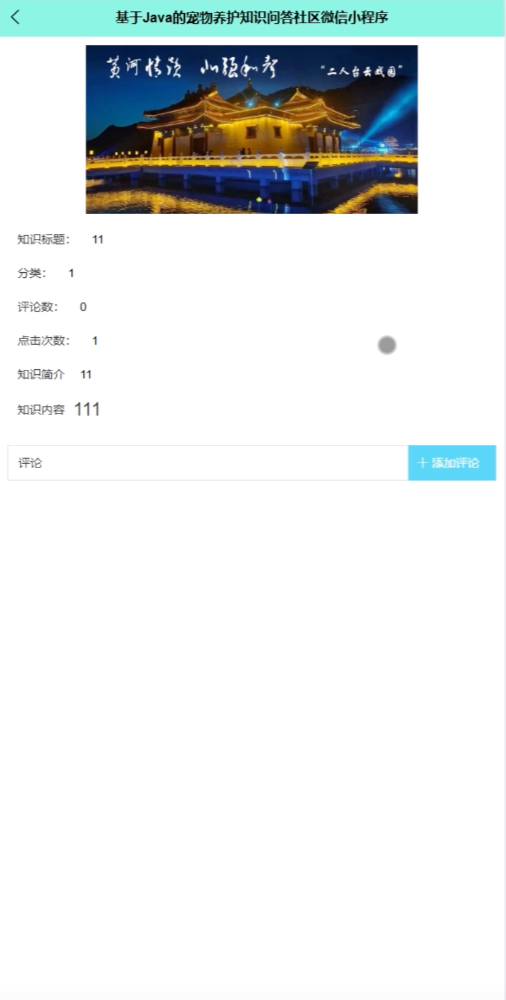

# mpweixinA233D
mpweixinA233D宠物养护知识问答社区微信小程序+LW
 
## 源码问题查看主页咨询

### 一、关键词
宠物养护系统、宠物问答社区、宠物知识平台、宠物交流系统、宠物护理小程序

### 二、作品包含
源码+数据库+设计文档+全套环境和工具资源+本地部署教程

### 三、项目技术
前端技术：Html、Css、Js、Vue3.2、Element-Plus、原生微信小程序
后端技术：Java、SpringBoot3.3.0、MyBatis-Plus

### 四、运行环境（以下版本亲测，其他版本兼容性请自行测试）
开发工具：IDEA/eclipse + VSCODE + 微信开发者工具

数据库：MySQL 8.0+

数据库管理工具：Navicat10以上版本

环境配置软件：JDK17 + Maven3.6+

前端Nodejs：16+

浏览器：谷歌浏览器

### 五、项目介绍
项目编号：mpweixinA233D

基于Java的宠物养护知识问答社区微信小程序，方便用户随时随地获取宠物养护知识、参与问答交流，提升宠物护理质量。

角色：管理员、用户

用户功能：注册登录、知识浏览、问答交流、分类查询、评论互动、个人中心。

管理员功能：登录、用户管理、知识库管理、分类管理、问答管理、评论管理、数据统计。

共11个数据库表。

### 六、运行截图

